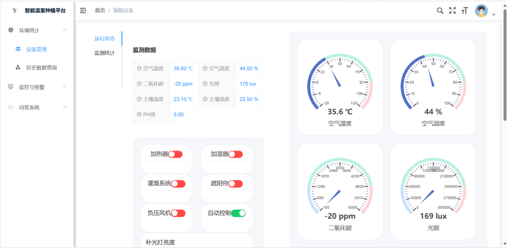

# Intelligence-greenhouse

# 项目简介
构建多节点分布式嵌入式系统，实现小车智能巡检、温室环境数据采集、病虫害检测、自动化控制及数据上云。

# 项目结构
本项目包含以下几个主要部分：
- **安卓应用**：移动端控制 / 显示界面
- **开发板代码**：开发板相关代码
- **ESP32 代码**：基于 ESP32 芯片的固件和应用
- **STM32 代码**：基于 STM32 系列单片机的程序

# 贡献指南
1. Fork 本仓库
2. 创建你的特性分支 (``git checkout -b feature/amazing-feature``)
3. 提交你的修改 (``git commit -m 'Add some amazing feature``)
4. 推送到分支 (``git push origin feature/amazing-feature``)
5. 打开一个 Pull Request
# 问题与反馈
如果遇到任何问题，请在Issues页面提交。
# 许可证
本项目采用 MIT 许可证 - 详见LICENSE文件。
